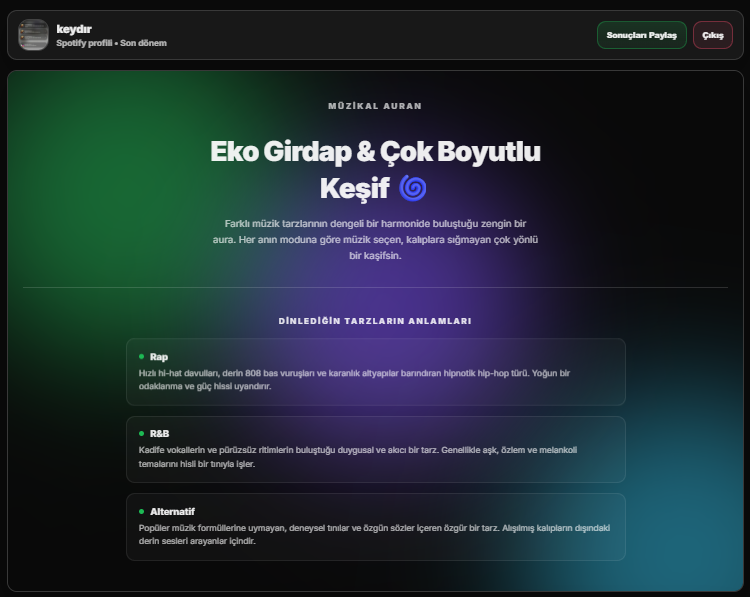
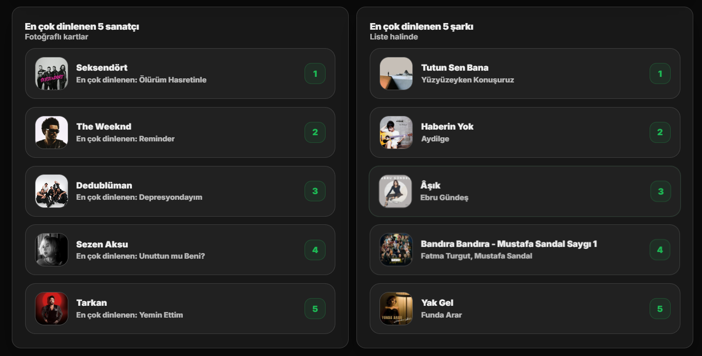

# 🎵 Müzik Kişiliği Analizi (Music Analyzer)

Spotify dinleme alışkanlıklarınızı analiz ederek müzikal karakterinizi, favori sanatçılarınızı, en çok dinlediğiniz şarkıları ve müzik zevkinizin genel profilini keşfetmenizi sağlayan modern bir web uygulaması.

🌐 **Canlı Uygulama:** https://musicaanalyzer.netlify.app/

---

## 🎯 Proje Hakkında

Music Analyzer, Spotify hesabınızdan alınan dinleme verilerini kullanarak size özel bir **müzikal aura**, **kişilik analizi** ve **müzik türü profili** oluşturur.

Uygulama; kullanıcıların son dönemde en çok dinlediği sanatçıları, şarkıları ve müzik türlerini analiz ederek bunları görsel kartlar, interaktif grafikler ve kişiselleştirilmiş açıklamalarla sunar.

---

## 🚀 Canlıda Denemek İsteyenler İçin

> ⚠️ Spotify API politikaları nedeniyle geliştirici modundaki uygulamalara yalnızca Spotify Developer panelinde tanımlı kullanıcılar erişebilir.

Uygulamayı kendi Spotify hesabınızla test etmek isterseniz, Spotify hesabınıza bağlı e-posta adresinizi aşağıdaki adrese gönderebilirsiniz:

📧 **[kaderterik3@gmail.com](mailto:kaderterik3@gmail.com)**

E-posta adresiniz geliştirici paneline eklendikten sonra uygulamaya giriş yapabilirsiniz.

---

## 📸 Ekran Görüntüleri




---

## ✨ Özellikler

### 🎨 Müzikal Aura Analizi

Dinlediğiniz müziklerin enerji, dans edilebilirlik ve pozitiflik değerlerine göre size özel bir aura oluşturulur.

Örnek aura tipleri:

- 🔥 Ateşli Ritimler
- 🌙 Sisli Gece Yarısı
- 🌅 Altın Günbatımı
- ⚡ Elektrik Fırtınası

Her aura kendine özgü açıklama ve görsel tema ile sunulur.

---

### 🧠 Müzik Kişiliği Analizi

Spotify verilerinizden elde edilen:

- Enerji Seviyesi
- Dans Edilebilirlik
- Pozitiflik (Valence)

değerleri analiz edilerek müzik kişiliğiniz yorumlanır.

---

### 🎤 En Çok Dinlenen Sanatçılar

- Son dönemdeki Top 5 sanatçı gösterilir.
- Sanatçı görselleri kart yapısında sunulur.
- Spotify profillerine doğrudan erişim sağlanabilir.

---

### 🎵 En Çok Dinlenen Şarkılar

- Top 5 şarkı listelenir.
- Şarkılar doğrudan Spotify üzerinde açılabilir.
- Sanatçı bilgileriyle birlikte görüntülenir.

---

### 📊 Tür (Genre) Dağılımı Analizi

Chart.js kullanılarak oluşturulan interaktif halka grafik sayesinde:

- En çok dinlediğiniz türler
- Türlerin yüzdesel dağılımı
- Müzikal eğilimleriniz

görsel olarak sunulur.

---

### 📖 Tür Sözlüğü

Dinlediğiniz türlerin:

- Temel özellikleri
- Tarihçeleri
- Karakteristik yapıları

hakkında açıklamalar gösterilir.

---

### 🎉 Konfeti ve Paylaşım Sistemi

Analiz tamamlandığında:

- Özel konfeti animasyonu oynatılır.
- Sonuçlar panoya kopyalanabilir.
- Arkadaşlarla paylaşılabilir.

---

### 🌗 Dark / Light Tema

- Sistem temasını otomatik algılar.
- Manuel tema değişimi yapılabilir.
- Responsive ve modern arayüz sunar.

---

## 🛠️ Kullanılan Teknolojiler

### Frontend

- HTML5
- CSS3
- Vanilla JavaScript (ES6+)

### Grafik ve Görselleştirme

- Chart.js

### Kimlik Doğrulama

- Spotify OAuth 2.0 PKCE Flow

### API

- Spotify Web API

### Hosting

- Netlify

---

## 🔐 Güvenlik

Bu proje Spotify'ın önerdiği modern kimlik doğrulama yöntemi olan **PKCE (Proof Key for Code Exchange)** akışını kullanmaktadır.

Avantajları:

- Client Secret gerektirmez
- Token güvenliği sağlar
- Tarayıcı tabanlı uygulamalar için uygundur
- Modern OAuth standartlarına uyumludur

---

## 💻 Yerel Kurulum

### 1. Repoyu Klonlayın

```bash
git clone https://github.com/kaderterik/MusicAnalyzer.git
cd MusicAnalyzer
```

### 2. Spotify Developer Uygulaması Oluşturun

1. https://developer.spotify.com/dashboard adresine gidin
2. "Create App" seçeneğine tıklayın
3. Uygulama bilgilerini doldurun
4. Redirect URI olarak aşağıdakilerden birini ekleyin:

```
http://localhost:5500/
```

veya kendi domain adresinizi kullanın.

5. Oluşturulan Client ID değerini kopyalayın.

---

### 3. Config Dosyasını Oluşturun

```bash
cp config.example.js config.js
```

Ardından `config.js` dosyasını açıp düzenleyin:

```javascript
const SPOTIFY_CLIENT_ID = "YOUR_CLIENT_ID";
```

---

### 4. Uygulamayı Başlatın

VS Code kullanıyorsanız:

- index.html dosyasına sağ tıklayın
- "Open with Live Server" seçin

> ⚠️ Spotify OAuth işlemleri file:// protokolünde çalışmaz. Uygulama mutlaka localhost üzerinden çalıştırılmalıdır.

---

## 📁 Proje Yapısı

```
MusicAnalyzer/
│
├── index.html           ← Ana uygulama
├── style.css            ← Stil dosyası
├── script.js            ← JavaScript kodları
├── config.example.js    ← Config şablonu (GitHub'da)
├── config.js            ← Gerçek Client ID (lokal, GitHub'a gitmiyor)
├── .gitignore           ← config.js'i korur
└── README.md            ← Bu dosya
```

---

## 🌟 Gelecek Geliştirmeler

- Daha detaylı müzik istatistikleri
- Spotify Wrapped benzeri yıllık özetler
- Kullanıcılar arası müzik uyumluluğu karşılaştırması
- Daha fazla aura ve kişilik kategorisi
- Çoklu dil desteği

---

## 📄 Lisans

Bu proje MIT Lisansı ile lisanslanmıştır.

---

<p align="center">
🎧 Spotify verilerinle müzik kişiliğini keşfet, müzikal auranı ortaya çıkar!
</p>
